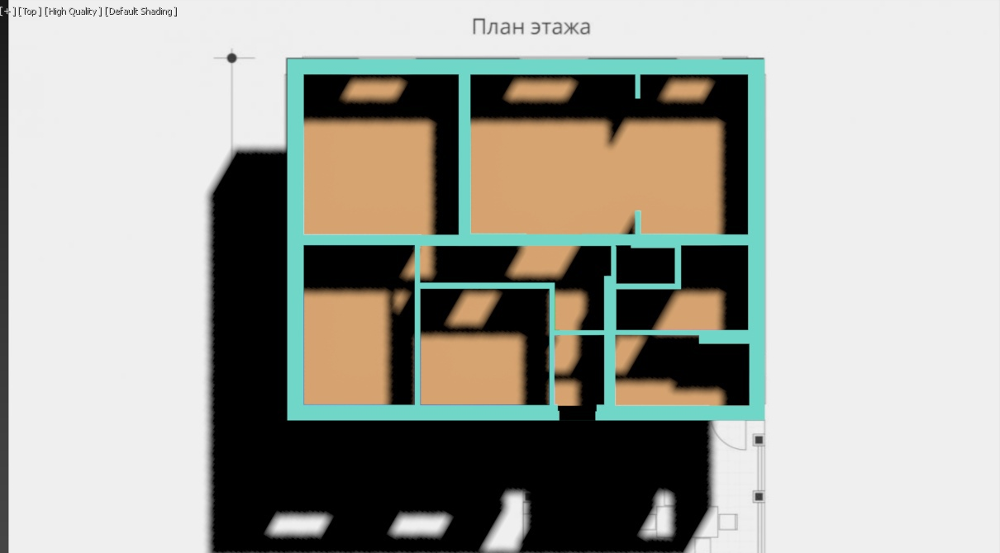
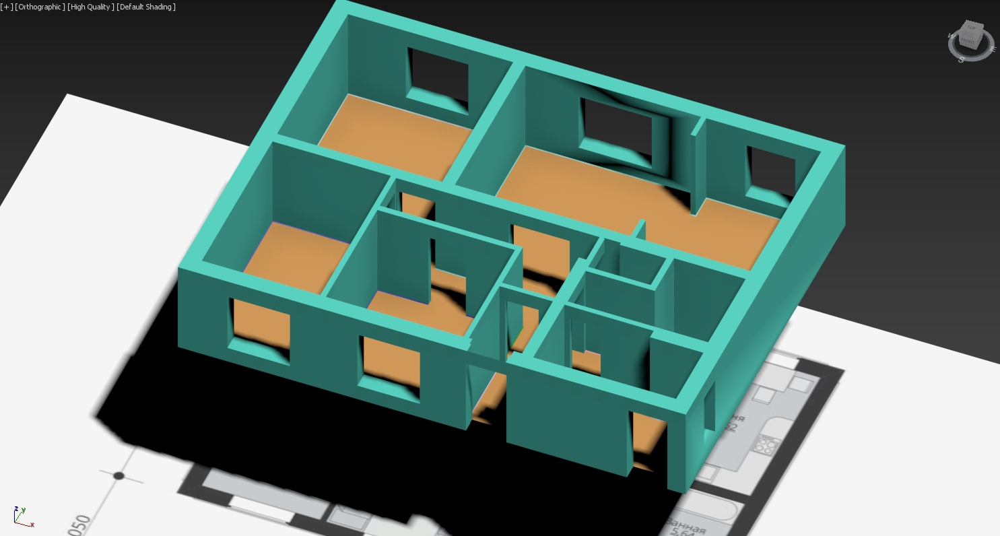
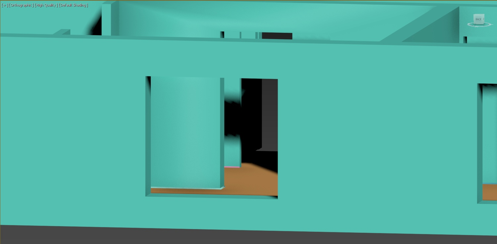

Table of Contents
=================

* [Table of Contents](#table-of-contents)
* [1. Computer graphic. Laboratory work](#Computer-graphic-Laboratory-work)
  * [1.1 Kitchen shelf](#11-kitchen-shelf)
  * [1.2 Eyes](#12-eyes)
  * [1.3 Can opener](#13-can-opener)
  * [1.4 Floor fan](#14-floor-fan)
  * [1.5 Paint deformation](#15-paint-deformation)
  * [1.6 Screw](#16-screw)
  * [1.7 House plan](#17-house-plan)

  

# 1. Computer graphic Laboratory work

## 1.1 Kitchen shelf

## 1.2 Eyes

## 1.3 Can opener

## 1.4 Floor fan

## 1.5 Paint deformation

## 1.6 Screw

## 1.7 House plan

