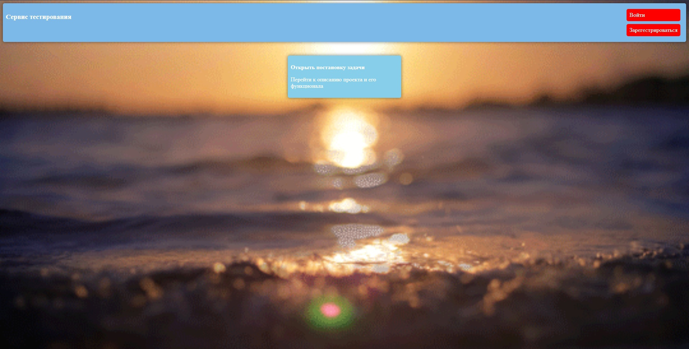
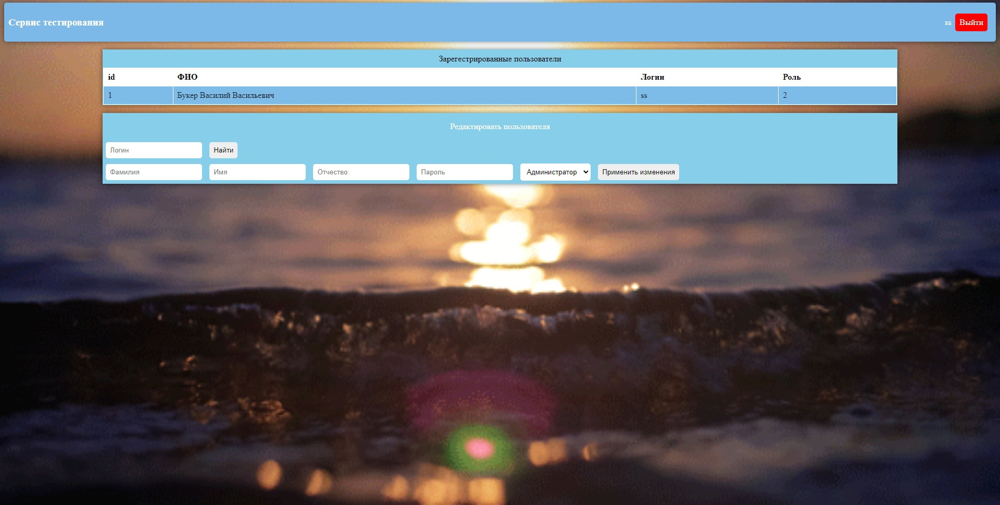
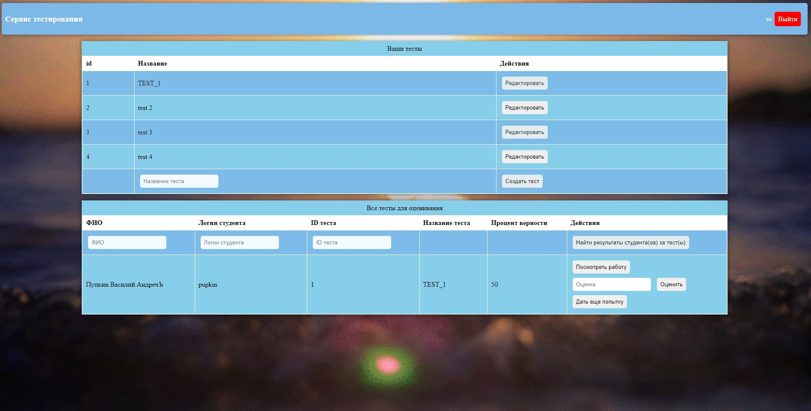
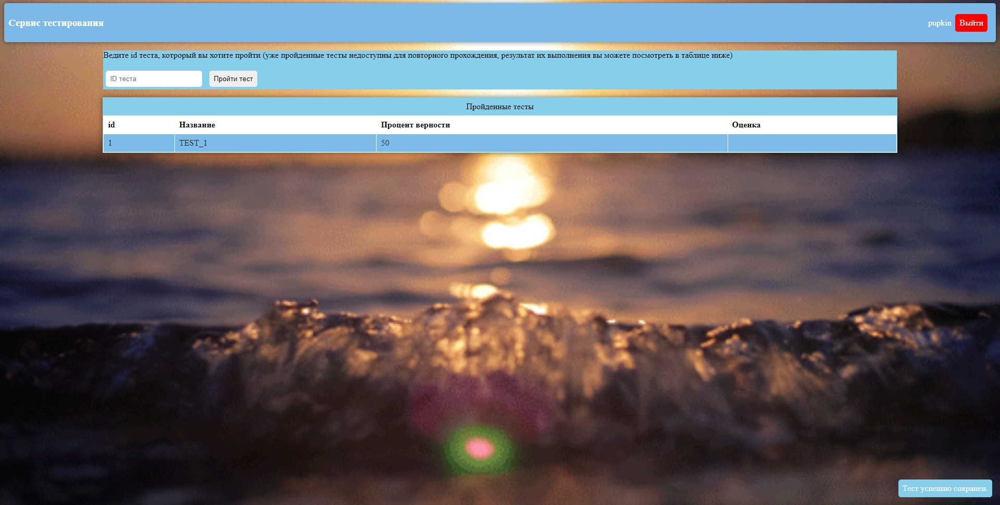

Table of Contents
=================

* [Table of Contents](#table-of-contents)
* [1. Interfaces](#1-interfaces)
    * [1.1 Main frame](#11-main-frame)
    * [1.2 Login frame](#12-login-frame)
    * [1.3 Registration frame](#13-registration-frame)
    * [1.4 Administrators frame](#14-administrators-frame)
    * [1.5 Teacher frame](#15-teacher-frame)
    * [1.6 Student frame](#16-student-frame)
* [2. Example](#2-example)

# 1. Interfaces

## 1.1 Main frame

## 1.2 Login frame

## 1.3 Registration frame

## 1.4 Administrators frame

## 1.5 Teacher frame

## 1.6 Student frame

# 2. Example

